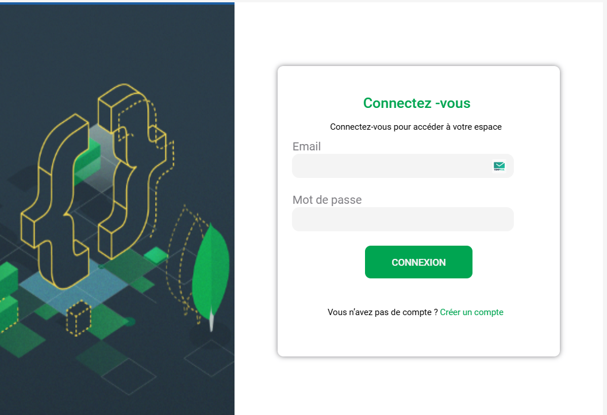

# Connectez-vous

<p align="center">
  
</p>

## 📋 Sobre o Projeto

Connectez-vous é uma página de login moderna e responsiva, desenvolvida para praticar e demonstrar habilidades em desenvolvimento web front-end. O projeto apresenta uma interface clean e intuitiva para autenticação de usuários.

## 🚀 Tecnologias Utilizadas

- HTML5 (34.1%)
- CSS3 (65.9%)

## 🔗 Links

- [Deploy na Vercel](https://connectez-vous-xi.vercel.app/)
- [Repositório Original](https://github.com/Lazarokaua/connectez-vous)

## 💻 Funcionalidades

- Design moderno e minimalista
- Campos para entrada de dados do usuário
- Layout adaptável para diferentes dispositivos

## 🎨 Layout

O projeto foi desenvolvido com foco em:

- Interface limpa e moderna
- Formulário de login intuitivo
- Elementos visuais harmoniosos

## 🛠️ Como Executar o Projeto

1. Clone este repositório:

```bash
git clone https://github.com/Lazarokaua/connectez-vous.git

```

2. Navegue até o diretório do projeto:

```bash
cd connectez-vous
```

3. Abra o arquivo `index.html` em seu navegador

## 👨‍💻 Autor

- [Lázaro Kauã](https://github.com/Lazarokaua)


---

⭐️ Se você gostou deste projeto, por favor, considere dar uma estrela no repositório!
